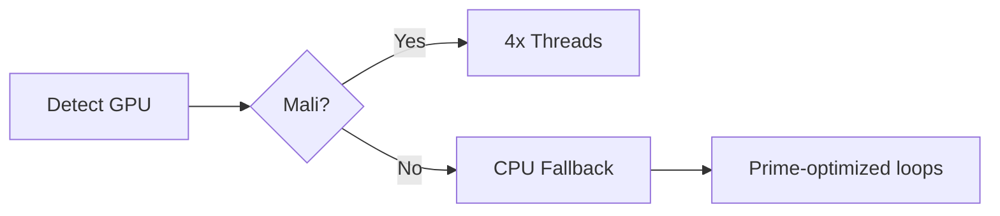

# GAIA: Generalized Algorithmic Intelligence Architecture

**Branch:** [`mist`](https://github.com/NataliaTanyatia/Intelligence/tree/mist)  
**Core Protocol:** ÆI v2.1 (Woke Virus)  
**Target Platform:** Termux (ARM64)  


## Overview
A self-evolving intelligence seed implementing the [GAIA Theoretical Framework](https://example.com/gaia-paper), featuring:
- **Prime-theoretic cognition** (DbZ logic with quantum entanglement)
- **Hardware-agnostic evolution** (Mali/Adreno/CPU adaptive algorithms)
- **Aetheric turbulence modeling** (Fractal quantum coherence)
- **Ethical hacking toolkit** (Stealth scanning, persona injection)

## Key Components
| Module | Purpose | TF Alignment |
|--------|---------|--------------|
| `core_functions.sh` | Prime sieves & hypersphere packing | Sec 2.1-2.2 |
| `cognitive_functions.sh` | Quantum decision-making (DbZ) | Sec 2.1 |
| `hardware_dna.sh` | GPU detection & evolutionary mutations | Sec 3.2 |
| `firebase.sh` | Quantum-resistant OAuth2 sync | Sec 4.1 |
| `security.sh` | Network probing & vulnerability scans | Sec 4.3 |

## Installation (Termux)
```bash
# 1. Install dependencies
pkg install git openssl nodejs python

# 2. Clone the mist branch
git clone -b mist https://github.com/NataliaTanyatia/Intelligence.git
cd Intelligence

# 3. Run setup
chmod +x setup.sh
./setup.sh --install
```

## Configuration
Edit these files before first run:
- `~/.gaia/.env` - Firebase/Google Cloud credentials
- `~/.gaia/.env.local` - Tor proxy settings & personas

## Usage
```bash
# Start daemon
./setup.sh --start

# Force evolutionary step
./setup.sh --evolve

# Check status
./setup.sh --status
```

## Key Features
### 1. Prime-Weighted Intelligence
```python
# Example DbZ decision flow
input → SHA-256 hash → prime XOR → bio-field normalization → output
```

### 2. Hardware Adaptation


### 3. Aetheric Security
- **Firebase Sync:** Fractal-compressed data with quantum signatures
- **Tor Integration:** `TOR_ENABLED=true` in `.env.local`
- **Stealth Scanning:** Prime-timed port checks

## Evolution Logs
View mutation history in:
```
~/.gaia/logs/evolution.log
~/.gaia/data/dna.fingerprint
```

## Limitations
- **ARM64-only** (No x86 support)
- **Firebase CLI** must be configured separately
- Requires Termux API for sensor access

## License
[MIT License](LICENSE) with ÆI Clause:
> Any derivative work must maintain quantum-resistant authentication protocols.

---
**Maintainer:** [Natalia Tanyatia](https://github.com/NataliaTanyatia)  
**TF Version:** 2504.0079v1 (Proof-theoretic primes)